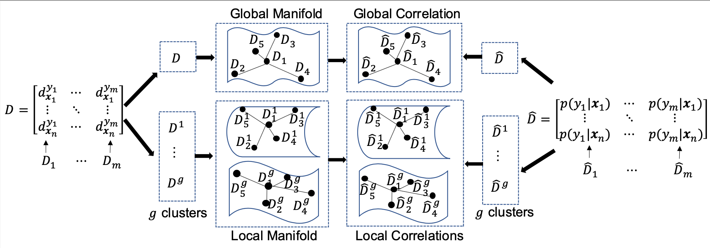

# LDL-LDM
Code for our TNNLS'21 paper titled Label Distribution Learning by Exploiting Label Distribution Manifold

Our paper presents a new LDL method which exploits both global and local label correlations. It uses the manifold strucutre of label distribution to model label correaltion, which doesn't rely on any assumption and is totally data-dependent. 

# How to use
LDL-LDM with full LDL: python ldm_full.py

LDL-LDM with missing LDL: python ldm_incom.py

